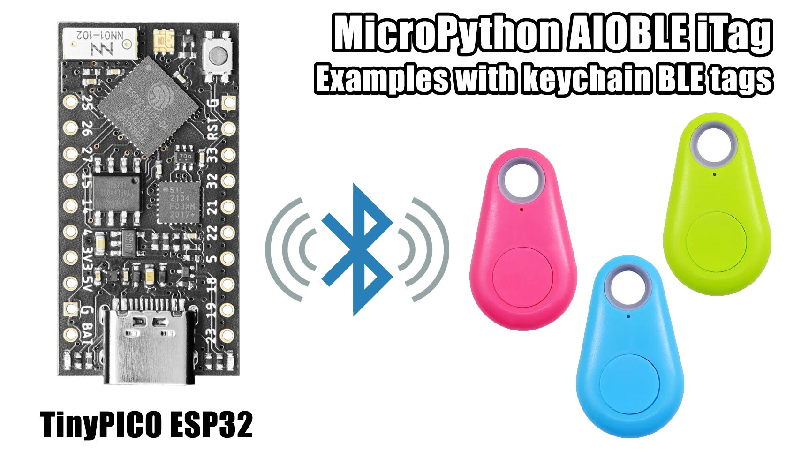
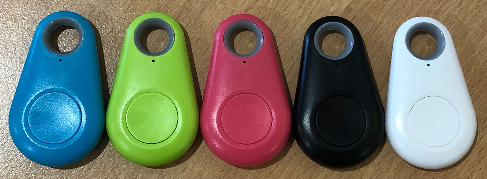
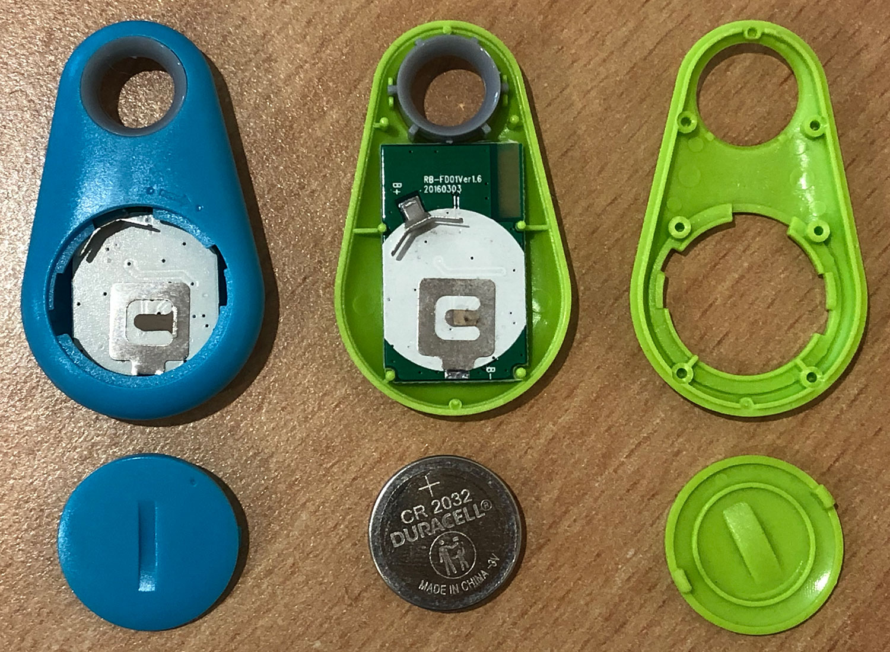
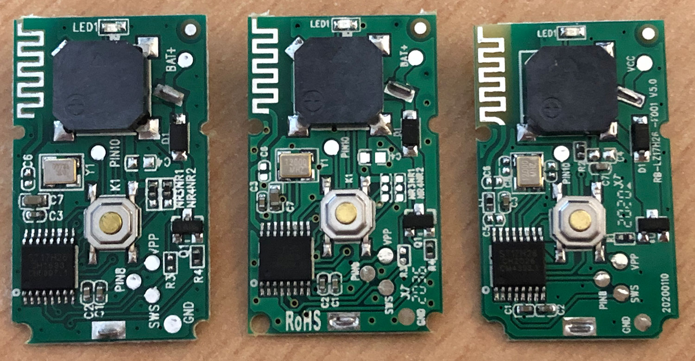
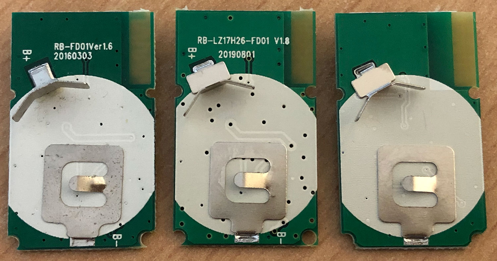

# MicroPython AIOBLE iTag

Examples for interacting with iTag BLE (Bluetooth 4.0) keychain devices using [aioble](https://github.com/micropython/micropython-lib/blob/master/micropython/bluetooth/aioble/README.md) on a TinyPICO (ESP32).



The tag is a simple [Bluetooth Low Energy](https://en.wikipedia.org/wiki/Bluetooth_Low_Energy) device with a single push button powered by a 3V CR-2032 Lithium cell.

You can connect to it, send a command to make it beep, read it's battery percentage and get notified when the button is pressed.

### Installation

Using mip via mpremote:

```bash
$ mpremote mip install aioble
```

See [examples](/examples).

### BLE GATT

GATT is an acronym for the Generic Attribute Profile.
It defines the way two Bluetooth Low Energy devices transfer data back and forth using concepts called Services and Characteristics.

The device presents 3 GATT services, each with a characteristic.

* Immediate Alert (0x1802)
	* Alert Level (0x2a06) - write

* Battery Service (0x180f)
	* Battery Level (0x2a19) - read

* Custom Service (0xffe0)
	* Custom Characteristic (0xffe1) - read/notify

### Mobile app

The tag can be interacted with using an app called "iSearching", found in the iOS an Android app stores.

### Powering

Power on the tag by holding the push button.
The iTag beeps twice and blinks LED to indicate it's on.

Power off the tag the same way.
It will long-beep once to indicate it's now off.

### Beeping

Write a `0x01` to the Immediate Alert > Alert Level characteristic and the tag will start fast-beeping.

Write a `0x00` to the characteristic to make the tag stop fast-beeping.

The tag will slow-beep after a connection has been made and then disconnected.
This is to let the user know the device is no longer in range (eg. has been left behind).
Press the tag button to acknowledge and mute.

### Battery

Read the Battery Service > Battery Level characteristic and it will return the tags current battery level expressed as a percentage (0x60 = 96%).

### Push button

Each time the tags push button is pressed, it sends a notification to the Custom Service > Custom Characteristic with a fixed value of 0x01.

You can listen for notifications on the Custom Characteristic to detect when the button is pressed.

### Teardown



Comes in a variety of colours. I bought one of each.



Battery compartment rotates to reveal the battery.
Case is loosely press fit together (no glue).
Easily pried apart with a pry tool or fingernail.



v1.6 | v1.8 | v5.0

MCU: ST17H26 TSSOP-16 RF Transceiver



v1.6 | v1.8 | v5.0

Even though they were all purchased on the same day, the PCBs show different versions and dates:

* v1.6 - 2016-03-03 - green tag
* v1.6 - 2016-03-03 - pink tag
* v1.8 - 2019-08-01 - blue tag
* v1.8 - 2019-08-01 - black tag
* v5.0 - 2020-01-10 - white tag

### Buy

These devices can be found on AliExpress under various names:

* Mini Pet Smart Tracker Bluetooth 4.0 GPS Alarm Locator Keychain for Pet Dog Cat Child ITag Tracker Key Finder Collar
* Mini GPS Tracker Bluetooth-compatible 4.0 Smart Dog Pets Anti-lost Alarm Tag Wireless Child Bag Wallet Key Finder Locator 25m
* Smart Bluetooth GPS Tracker Work for Apple Find My APP ITag Anti Lost Reminder Device MFI Rated Locator Car Key Pet Kids Finder
* Good Mini Pet Smart Tracker Bluetooth 4.0 GPS Alarm Locator Keychain for Pet Dog Cat Child ITag Tracker Key Finder Collar
* Bluetooth Key Finder Smart Anti Lost Device GPS Locator Tracker Tag iTag Alarm Localizado for Kids Pet Dog Cat Wallet Bag

Don't be fooled by the descriptions. There is NO GPS in the device!

Price ranges from $2 to $20 AUD.

## Links

* [micropython.org](http://micropython.org)
* [ST17H26 datasheet](docs/st17h26.pdf)
* [TinyPICO Getting Started](https://www.tinypico.com/gettingstarted)

## License

Licensed under the [MIT License](http://opensource.org/licenses/MIT).

Copyright (c) 2024 Mike Causer
